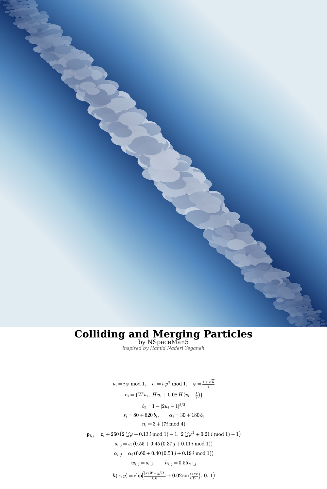
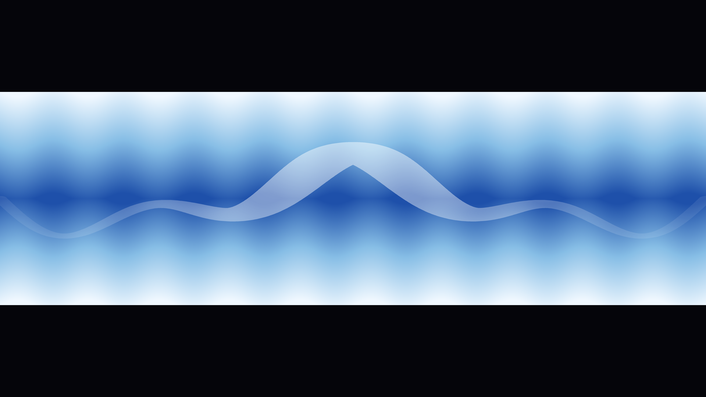

# math-aug


A deterministic mathematical-art generator. Every artwork is produced
**100% from algebraic formulas** — no input images, no textures, no
procedural noise, no AI. The visual structure of each piece is fully
described by a handful of equations and rendered from thousands of
primitive geometric elements.

Method inspired by [Hamid Naderi Yeganeh](https://www.hamidnaderiyeganeh.com/).

## What This Is

A collection of standalone deterministic artworks, each living in its own
folder under `universal/`. Every piece is:

- **Deterministic** — the same formula produces the same output, bit-for-bit.
  No RNG, no sampling, no noise.
- **Algebraic** — every point, ellipse, and pixel color is computed by
  an explicit expression. The full recipe fits in a few lines of LaTeX.
- **Composed of primitives** — images are aggregations of hundreds to
  thousands of circles, ellipses, or line segments placed by an index
  parameter `i`.
- **Self-documenting** — every artwork ships with its `.tex` recipe,
  its Python generator, and its rendered PNG, side by side.

### Spatial compression

The organic-looking density gradients that make these pieces feel alive
come from high-exponent trigonometric terms such as `sin^n(πu)`. These
flatten near zero and spike sharply near their peaks, concentrating
elements into narrow bands that the eye reads as shadow, volume, or flow.

### Explicitly avoided

- Input images, photos, external textures
- Manual drawing in any graphics editor
- Perlin noise, Simplex noise, fluid / particle simulation
- Generative AI, diffusion models, GANs
- Post-processing filters that cannot be written as formulas

## Available Artworks

| ID | Folder | Canvas | Primitives | Status |
|----|--------|--------|------------|--------|
| 01 | `universal/colliding-merging-particles/` | 7680×7680 | ~1,200 ellipses | ✅ done |
| 02 | `universal/pusaran-magma-air/` | 7680×4320 | ~6,000 ellipses | 🚧 in progress |

Each folder contains:
- `src/` — the Python generator (pure NumPy)
- `recipe/` — the LaTeX derivation
- `artwork.png` — full-resolution render
- `panel.png` — title + formulas (white background)
- `final.png` — artwork stacked above the panel
- `preview_final.png` — lightweight preview

## Quick Start

### 01 — Colliding and Merging Particles

A diagonal stream of low-discrepancy particle clusters, bulging at the
center where collisions and mergers concentrate.

```python
import sys, numpy as np
sys.path.insert(0, "universal/colliding-merging-particles/src")
import particles as P

# 1. Deterministic background gradient
canvas = P.sky_gradient()                    # (7680, 7680, 3) uint8

# 2. Deterministic particle clusters
x, y, w, h, alpha = P.cloud_ellipses()
# x, y       -> center of each ellipse
# w, h       -> width and height
# alpha      -> opacity in [0, 255]
```

The generator exposes two pure functions:

```python
def sky_gradient() -> np.ndarray:
    """Return RGB canvas as (H, W, 3) uint8 array."""

def cloud_ellipses() -> tuple[np.ndarray, ...]:
    """Return (x, y, w, h, alpha) arrays for all ellipses."""
```

No arguments. No seeds. No randomness. Same output every time.

### 02 — Pusaran Magma & Air (in progress)

A vertically stacked composition: an air ocean on top, an empty sky in
the middle, a magma ocean below. The two vortices are mirrored across
the horizon.

```python
import sys, numpy as np
sys.path.insert(0, "universal/pusaran-magma-air/src")
import sky as SK

sky_gradient = SK.sky_gradient()             # (2320, 7680, 3) uint8
cx, cy, w, h, alpha = SK.cloud_ellipses()    # cloud ellipses in the sky band
```

Status: sky layer complete. Ocean layers (air vortex + magma vortex)
not yet implemented.

## Visual Output

### 01 — Colliding and Merging Particles



Top: the 7680×7680 artwork — a diagonal particle stream bulging at its
midpoint. Bottom: the title, author, and the full LaTeX recipe on a
white panel.

Core relations driving the composition:

$$u_i = i\varphi \bmod 1, \qquad \varphi = \frac{1+\sqrt{5}}{2}$$

$$b_i = 1 - \left| 2u_i - 1 \right|^{3/2}$$

The bulge weight `b_i` densifies the middle of the stream, which the eye
reads as the collision and merger zone.

### 02 — Pusaran Magma & Air



Sky layer only. Air vortex and magma vortex are the next milestones.

## Repository Layout

```
math-aug/
├── universal/
│   ├── colliding-merging-particles/
│   │   ├── src/particles.py
│   │   ├── recipe/particles.tex
│   │   ├── artwork.png
│   │   ├── panel.png
│   │   ├── final.png
│   │   └── preview_final.png
│   └── pusaran-magma-air/
│       ├── src/sky.py
│       ├── recipe/
│       ├── sky.png
│       └── sky_full.png
└── README.md
```

Each artwork is fully self-contained. Adding a new piece means creating
a new folder under `universal/` — nothing else changes.

## Installation

```bash
pip install numpy pillow matplotlib
```

No build system. No compiled extensions. Pure Python + NumPy + Pillow.

## Architecture

Every generator follows the same contract:

```python
def <layer_name>() -> np.ndarray | tuple[np.ndarray, ...]:
    """Pure function. No arguments. Deterministic output."""
```

Rendering composes layers in order:

```
1. gradient        -> background canvas (H, W, 3) uint8
2. primitives      -> ellipses with (x, y, w, h, alpha)
3. compositing     -> alpha-blend onto canvas (Pillow)
4. panel           -> title + LaTeX formulas (matplotlib)
5. stack           -> artwork + panel, vertical concat
```

Determinism is verified by re-running the generator and hashing the
resulting array.

## Why This Exists

This is a **data engineering portfolio project**. The art is the payload;
the point is the pipeline:

- Deterministic generators (reproducible bit-for-bit)
- LaTeX recipes versioned alongside code
- Structured rendering (primitives → composite → panel)
- Git-based dataset versioning

The same discipline used for reproducible datasets is applied here to
deterministic visual output.

## Credits

- Method inspired by **Hamid Naderi Yeganeh**
- Code, formulas, and compositions by **VynJustHumant**

## License

MIT — see [LICENSE](LICENSE).
